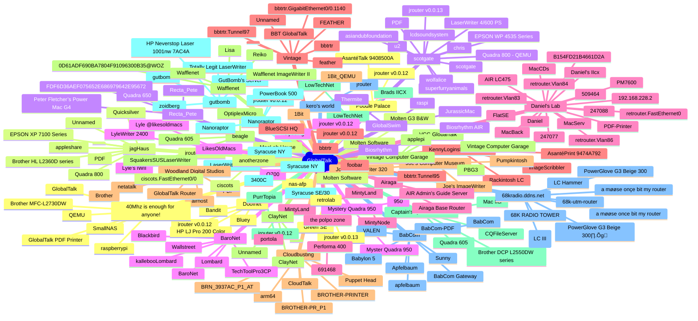

```mermaid
mindmap
root)GlobalTalk(
  Doofnet
    jrouter v0.0.12
    Bluey
    HP LJ Pro 200 Color
    nas-afp
    Bandit
  MacLab House
    jrouter v0.0.12
  scotgate
    Quadra 800 - QEMU
    EPSON WP 4535 Series
    jrouter v0.0.13
    wolfalice
    u2
    asiandubfoundation
    chris
    PDF
    LaserWriter 4/600 PS
    superfurryanimals
    lcdsoundsystem
    scotgate
  Mystery Quadra 950
    Myster Quadra 950
    950
  Daniel's Lab
    retrouter.FastEthernet0
    MacServ
    192.168.228.2
    509464
    247077
    FlatSE
    AIR LC475
    PDF-Printer
    retrouter.Vlan84
    retrouter.Vlan86
    247088
    Daniel
    B154FD21B4661D2A
    MacCDs
    PM7600
    MacBack
    Daniel's IIcx
    retrouter.Vlan83
  KennyLoginsDangerZone
    ImageScribbler
    AsantéPrint 9474A792
    Rackintosh LC
  Joe's Computer Museum
    Pumpkintosh
    Joe's LaserWriter 320
    Joe's ImageWriter
  Vintage Computer Garage
    PBG3
    Vintage Computer Garage
    VCG GlobalTalk
    applepi
  Captain's Quarters II BBS
    Quadra 605
    Brother DCP L2550DW series
    CQFileServer
    Mac IIci
    
  gutbomb
    Totally Legit LaserWriter
    gutbomb
    zoidberg
    GutBomb's Server
    HP Neverstop Laser 1001nw 7AC4A
  68kradio.ddns.net
    PowerGlove G3 Beige 300
    68K RADIO TOWER
    68K Radio HQ (LC III)
    LC Hammer
    a møøse onçe bit my router
    PowerGlove G3 Beige 300∏.Õg
    68k-utm-router
    a møøse once bit my router
  Poodle Palace
    jrouter v0.0.12
    AsantéTalk 9408500A
  Molten Software
    Molten Software
    Molten G3 B&W
  Biosrhythm
    Biosrhythm AIR
  LikesOldMacs
    Lyle's IWII
    Q700
    LyleWriter 2400
    Lyle @likesoldmacs
  MintyLand
    MintyNode
    MintyLand
  Vintage
    bbtrtr
    <Unnamed>
    bbtrtr.GigabitEthernet0/0.1140
    FEATHER
    bbtrtr.Tunnel97
    feather
    BBT GlobalTalk
    Unnamed
  Cloudbusting
    arm64
    BRN_3937AC_P1_AT
    BROTHER-PRINTER
    CloudTalk
    Puppet Head
    BROTHER-PR_P1
  beagle
    OptiplexMicro
    Quadra 605
    SquakersSUSLaserWriter
  LowTechNet
    Brads IICX
    LowTechNet
  Syracuse NY
    3400C
    Syracuse NY
    LaserWriter Select
    Syracuse SE/30
  BabCom
    VALEN
    BabCom Gateway
    BabCom
    Apfelbaum
    Babylon 5
    Sunny
    apfelbaum
    BabCom-PDF
  retrolab
    jrouter v0.0.13
    Green SE
  jagHaus
    <Unnamed>
    Quicksilver
    appleshare
    Brother HL L2360D series
    Quadra 800
    PDF
    EPSON XP 7100 Series
    Unnamed
  GlobalSwim
    JurassicMac
    Thermite
    raspi
  netjibbing
    jrouter v0.0.12
  Airaga
    AIR Admin’s Guide Server
    Airaga Base Router
  foobar
    bbtrtr
    bbtrtr.Tunnel95
  Woodland Digital Studios
    netatalk
    airhost
    GlobalTalk Router
    PDF
    Brother
  ClayNet
    <Unnamed>
    Unnamed
    ClayNet
  PurrTopia
    jrouter v0.0.12
  Nanoraptor
    jrouter v0.0.12
    Nanoraptor
    PowerBook 500
  kero's world
    jrouter
  40Mhz is enough for anyone!
    QEMU
    GlobalTalk PDF Printer
    SmallNAS
    raspberrypi
    GlobalTalk
    Brother MFC-L2730DW
  anotherzone
    ciscots.FastEthernet0/0
    ciscots
  Recta_Pete
    Peter Fletcher’s Power Mac G4
    FDF6D36AEF075652E686979642E95672
    Recta_Pete
    Quadra 650
  BaroNet
    BaroNet
    kallebooLombard
    Blackbird
    Wallstreet
    Lombard
    TechToolPro3CP
  the polpo zone
    Performa 400
    691468
    portola
  BlueSCSI HQ
    jrouter v0.0.12
  1Bit
    1Bit_QEMU
  Wafflenet
    Lisa
    Reiko
    Wafflenet
    0D61ADF690BA7804F91096300B35@WOZ
    Wafflenet ImageWriter II

```