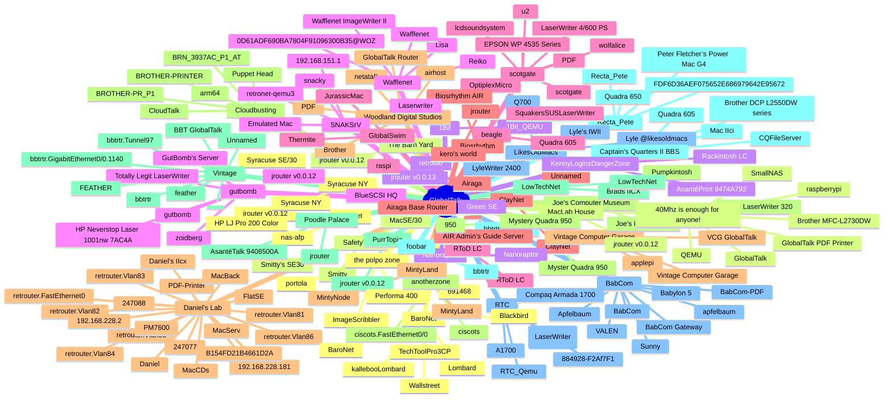

```mermaid
mindmap
root)GlobalTalk(
  Doofnet
    nas-afp
    jrouter v0.0.12
    HP LJ Pro 200 Color
  SafetyThird
    Smitty's SE30
    MacSE/30
    Smitty
  1Bit
    1Bit_QEMU
  gutbomb
    HP Neverstop Laser 1001nw 7AC4A
    Totally Legit LaserWriter
    zoidberg
    GutBomb's Server
    gutbomb
  scotgate
    LaserWriter 4/600 PS
    lcdsoundsystem
    EPSON WP 4535 Series
    scotgate
    PDF
    wolfalice
    u2
  ClayNet
    <Unnamed>
    ClayNet
    Unnamed
  Vintage Computer Garage
    applepi
    VCG GlobalTalk
    Vintage Computer Garage
  Joe's Computer Museum
    Pumpkintosh
    Joe's LaserWriter 320
    Joe's ImageWriter
  PurrTopia
    jrouter v0.0.12
  Recta_Pete
    Recta_Pete
    FDF6D36AEF075652E686979642E95672
    Quadra 650
    Peter Fletcher’s Power Mac G4
  LikesOldMacs
    Q700
    LyleWriter 2400
    Lyle @likesoldmacs
    Lyle's IWII
  Syracuse NY
    Syracuse SE/30
    Syracuse NY
  The Barn Yard
    jrouter v0.0.12
  retrolab
    jrouter v0.0.13
    Green SE
  BlueSCSI HQ
    jrouter v0.0.12
  beagle
    OptiplexMicro
    SquakersSUSLaserWriter
    Quadra 605
  Biosrhythm
    Biosrhythm AIR
  Woodland Digital Studios
    GlobalTalk Router
    Brother
    netatalk
    PDF
    airhost
  Cloudbusting
    BROTHER-PRINTER
    BRN_3937AC_P1_AT
    BROTHER-PR_P1
    CloudTalk
    Puppet Head
    arm64
  Poodle Palace
    AsantéTalk 9408500A
    jrouter
  Captain's Quarters II BBS
    
    Mac IIci
    Brother DCP L2550DW series
    CQFileServer
    Quadra 605
  BabCom
    BabCom Gateway
    BabCom-PDF
    VALEN
    apfelbaum
    Sunny
    Babylon 5
    BabCom
    Apfelbaum
  the polpo zone
    portola
    ImageScribbler
    Performa 400
    691468
  40Mhz is enough for anyone!
    SmallNAS
    raspberrypi
    GlobalTalk
    QEMU
    Brother MFC-L2730DW
    GlobalTalk PDF Printer
  Nanoraptor
    Nanoraptor
  Wafflenet
    Reiko
    0D61ADF690BA7804F91096300B35@WOZ
    Wafflenet ImageWriter II
    Lisa
    Wafflenet
  RToD LC
    RToD LC
  kero's world
    jrouter
  Daniel's Lab
    retrouter.Vlan85
    247088
    retrouter.Vlan86
    retrouter.Vlan82
    PM7600
    Daniel
    retrouter.FastEthernet0
    FlatSE
    192.168.228.181
    MacServ
    retrouter.Vlan83
    247077
    MacCDs
    192.168.228.2
    Daniel's IIcx
    B154FD21B4661D2A
    PDF-Printer
    retrouter.Vlan81
    MacBack
    retrouter.Vlan84
  anotherzone
    ciscots
    ciscots.FastEthernet0/0
  Vintage
    <Unnamed>
    bbtrtr.GigabitEthernet0/0.1140
    FEATHER
    bbtrtr
    bbtrtr.Tunnel97
    BBT GlobalTalk
    Unnamed
    feather
  foobar
    bbtrtr
    bbtrtr.Tunnel95
  RTC
    Panasonic KXP2123 (LaserWriter)
    RTC_Qemu
    Compaq Armada 1700
    A1700
    884928-F2Af7F1
  BaroNet
    kallebooLombard
    Lombard
    Blackbird
    BaroNet
    TechToolPro3CP
    Wallstreet
  MacLab House
    jrouter v0.0.12
  KennyLoginsDangerZone
    AsantéPrint 9474A792
    Rackintosh LC
  SNAKSrV
    Laserwriter
    snacky
    192.168.151.1
    retronet-qemu3
    Emulated Mac
  GlobalSwim
    Thermite
    raspi
    JurassicMac
  Airaga
    Airaga Base Router
    AIR Admin’s Guide Server
  MintyLand
    MintyNode
    MintyLand
  Mystery Quadra 950
    950
    Myster Quadra 950
  LowTechNet
    Brads IICX
    LowTechNet

```